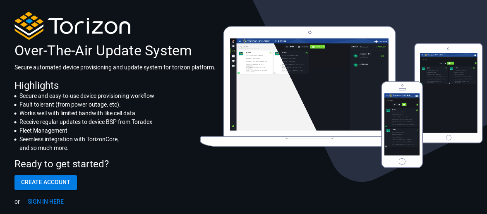
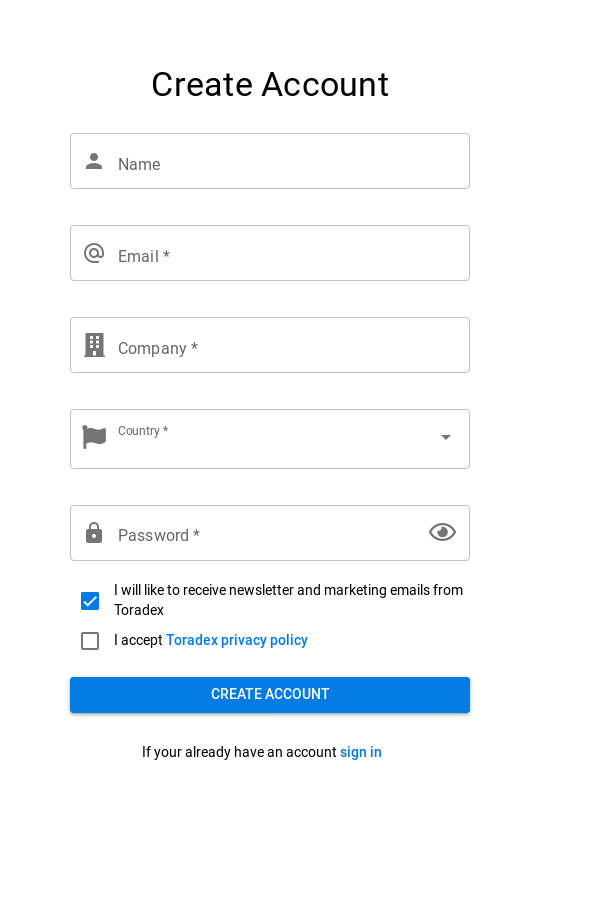
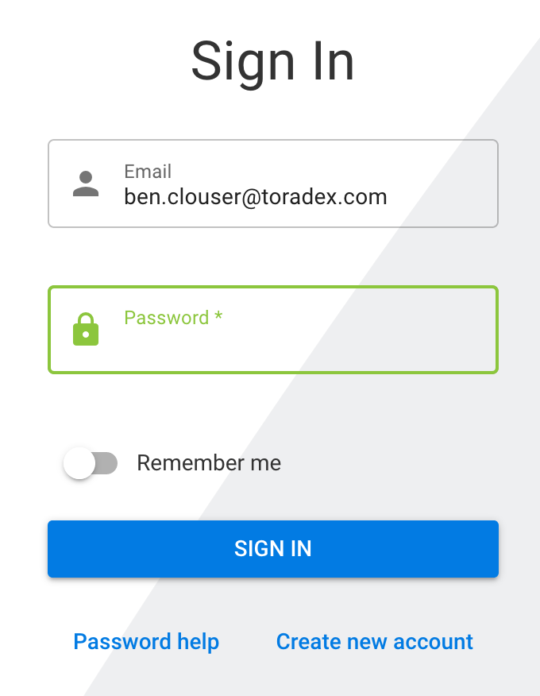
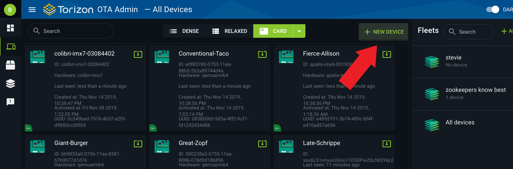
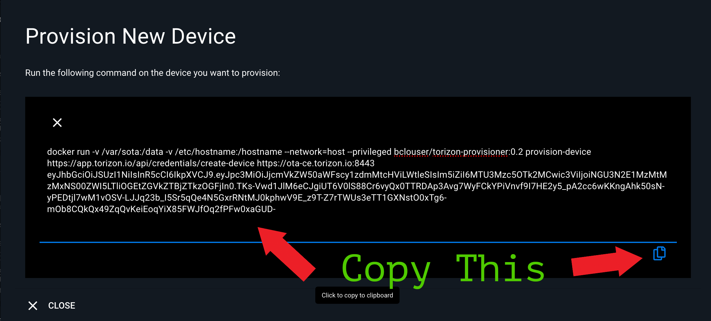
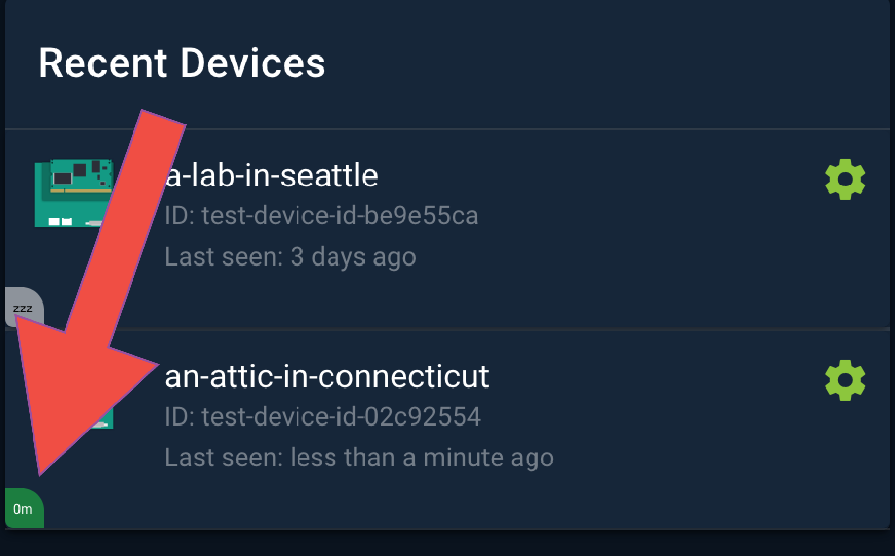

<a href="https://app.torizon.io">
   
</a>  

# Torizon OTA
- A Project under active Development in [Toradex Labs](https://labs.toradex.com/projects/torizon-over-the-air)
-  :warning: :biohazard: **Toradex OTA is EXPERIMENTAL!!!** :zap: :bomb:

# Getting started with OTA
:pencil:
**Running TorizonCore is a pre-requisite for using Toradex OTA**  
You can learn about TorizonCore on our developer site: 
https://developer.toradex.com/software/torizon

## Accessing the OTA Admin Frontend
---
### navigate to https://app.torizon.io
- Create a user-account  
   
  
- Log In
  
    
# Explore :smirk: 
- Provide feedback/shower-thoughts in this slack channel: https://toradexlabs.slack.com/messages/ota/

## Provisioning A Device
- In the web frontend, under the devices page, click on the "NEW DEVICE" button.
   
   
- Copy premade docker command
 

- Login to a module running TorizonCore

- paste and run command  
:pencil: So far this has worked well for me even over serial console. There is the likelihood for data to become garbled/corrupted when copying over serial. Please report this if you experience it.


... or if you want to watch the aktualizr logs 
```
sudo journalctl -f -u aktualizr
```
Example logs:
```
root@apalis-imx6-05076305:/var/sota# sudo journalctl -f -u aktualizr
-- Logs begin at Fri 2019-09-13 03:50:29 UTC. --
Sep 13 19:13:19 apalis-imx6-05076305 aktualizr[15032]: Use existing SQL storage: "/var/sota/sql.db"  
Sep 13 19:13:19 apalis-imx6-05076305 aktualizr[15032]: Couldn't import data: "/var/sota/import/root.crt" doesn't      exist.   
Sep 13 19:13:19 apalis-imx6-05076305 aktualizr[15032]: Couldn't import data: "/var/sota/import/client.pem" doesn't exist.   
Sep 13 19:13:19 apalis-imx6-05076305 aktualizr[15032]: Couldn't import data: "/var/sota/import/pkey.pem" doesn't exist.   
Sep 13 19:13:19 apalis-imx6-05076305 aktualizr[15032]: Could not find primary ecu serial, defaulting to empty serial: no more rows available  
Sep 13 19:13:19 apalis-imx6-05076305 aktualizr[15032]: Certificate is not found, can't extract device_id  
Sep 13 19:13:19 apalis-imx6-05076305 systemd[1]: aktualizr.service: Main process exited, code=exited, status=255/EXCEPTION  
Sep 13 19:13:19 apalis-imx6-05076305 systemd[1]: aktualizr.service: Failed with result 'exit-code'.  
Sep 13 19:13:19 apalis-imx6-05076305 systemd[1]: Stopped Aktualizr SOTA Client.  
Sep 13 19:15:27 apalis-imx6-05076305 systemd[1]: Started Aktualizr SOTA Client.  
Sep 13 19:15:27 apalis-imx6-05076305 aktualizr[15078]: Aktualizr version 1.0+gitAUTOINC+505627bbf4 starting  
Sep 13 19:15:27 apalis-imx6-05076305 aktualizr[15078]: Reading config: "/usr/lib/sota/conf.d/20-sota_implicit_prov_ca.toml"  
Sep 13 19:15:27 apalis-imx6-05076305 aktualizr[15078]: Reading config: "/usr/lib/sota/conf.d/40-hardware-id.toml"  
Sep 13 19:15:27 apalis-imx6-05076305 aktualizr[15078]: Reading config: "/etc/sota/conf.d/sota.toml"  
Sep 13 19:15:27 apalis-imx6-05076305 aktualizr[15078]: Bootstrap empty SQL storage  
Sep 13 19:15:27 apalis-imx6-05076305 aktualizr[15078]: Bootstraping DB to version 18  
Sep 13 19:15:27 apalis-imx6-05076305 aktualizr[15078]: Could not find primary ecu serial, defaulting to empty serial: no more rows available  
Sep 13 19:15:29 apalis-imx6-05076305 aktualizr[15078]: ECUs have been successfully registered to the server  
Sep 13 19:15:32 apalis-imx6-05076305 aktualizr[15078]: got SendDeviceDataComplete event  
```
- Your device should now be provisioned and talking with the ota backend!
 

# Packages and Updates
Toradex is publishing nightly development builds to the OTA server.   
At this time, we do not allow users of the system to publish their own images

## Container updates
A big feature of TorizonCore is the ability to run containers, and therefore one would expect to be able to update their containers from the OTA server.   
This feature is planned, but not currrently implemented in Torizon OTA. Look for it in future versions!


# Debugging
- Upon provisioning device, you receive:
    ```
     Failed to download token :(
     HTTP ERROR 000
    ```
  - This usually means you aren't able to resolve the server's hostname. Make sure your network connection is up, and DNS is working as expected.
